# 宿舍管理系统

### 使用不同技术栈的相同项目 ：[springboot+vue宿舍管理系统](https://github.com/34426/StudentDormitory)

### 有问题，或者不会调试运行的同学, 可以添加微信(备注项目)：xzxj0206

## 一、介绍

### 采用Servlet+JSP+MySQL，界面采用bootstrap，简洁大方。

## 二、系统运行界面

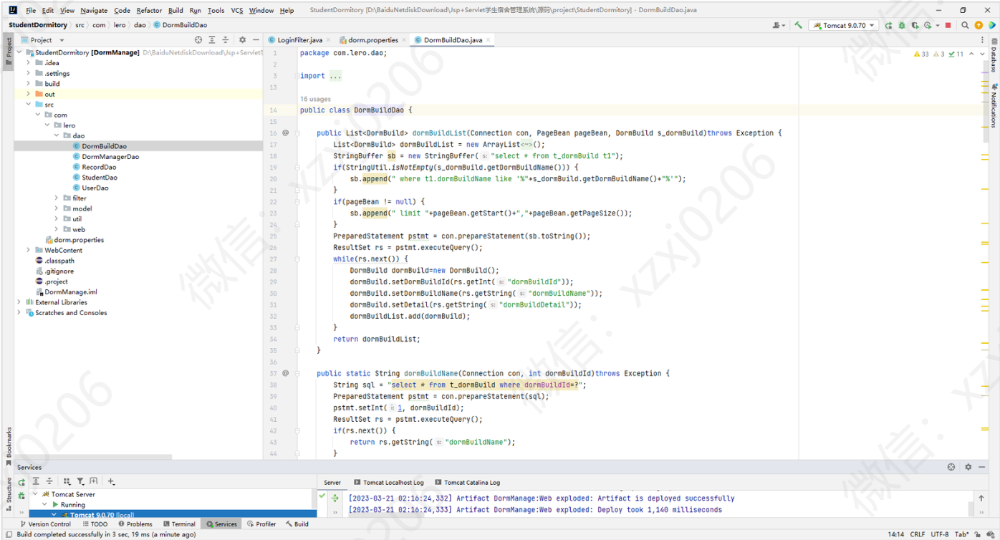

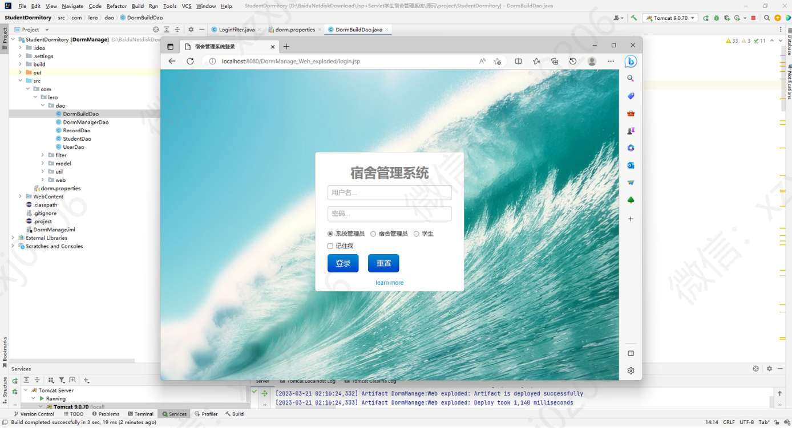

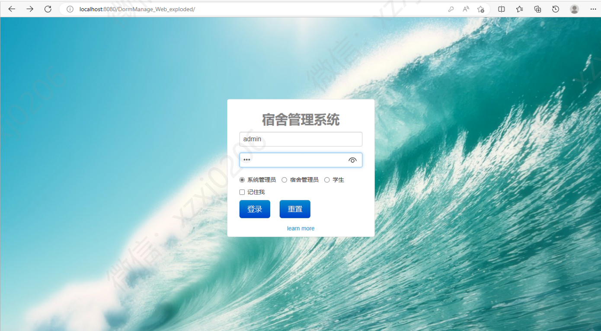

## 三、部分功能界面展示

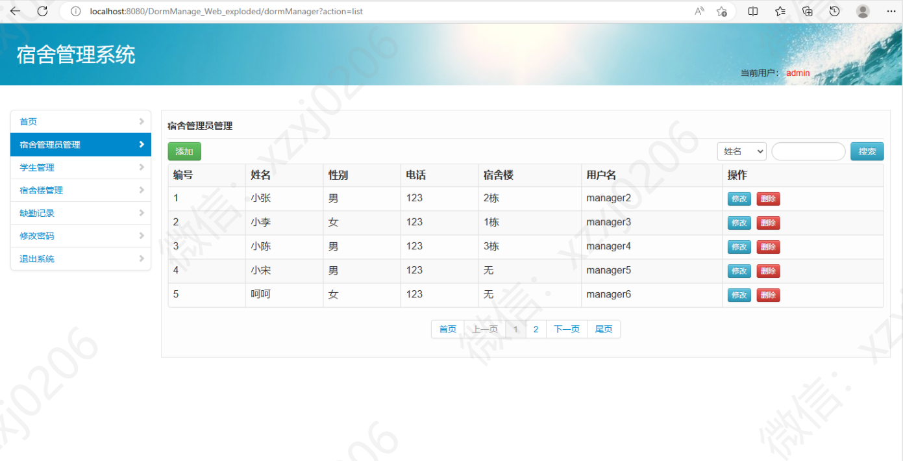

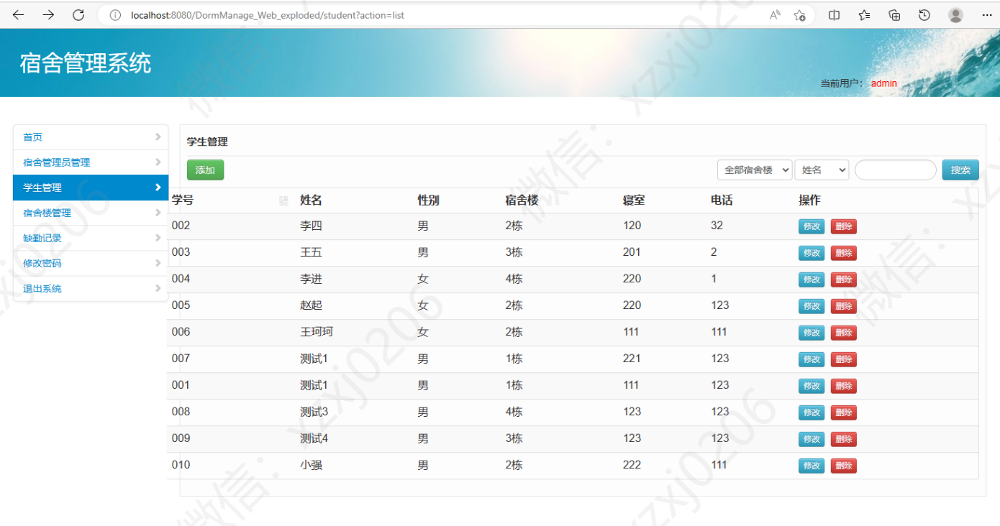

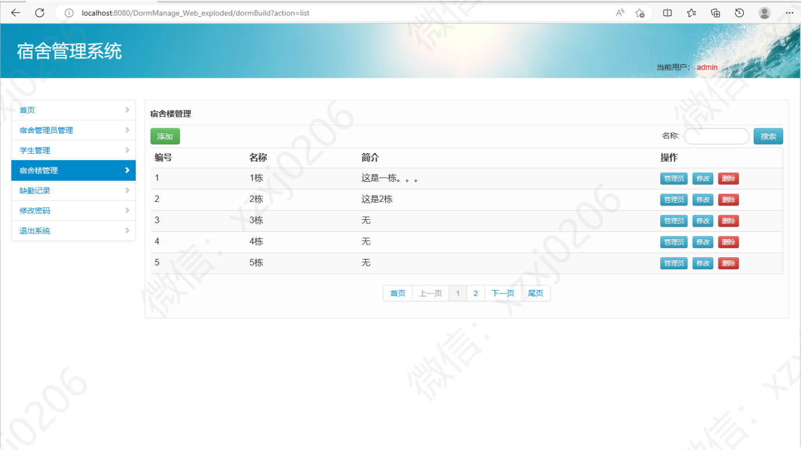

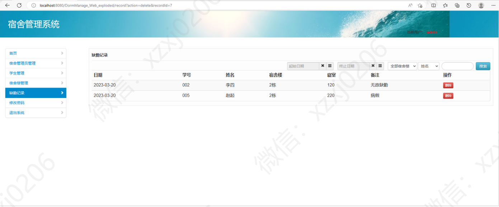

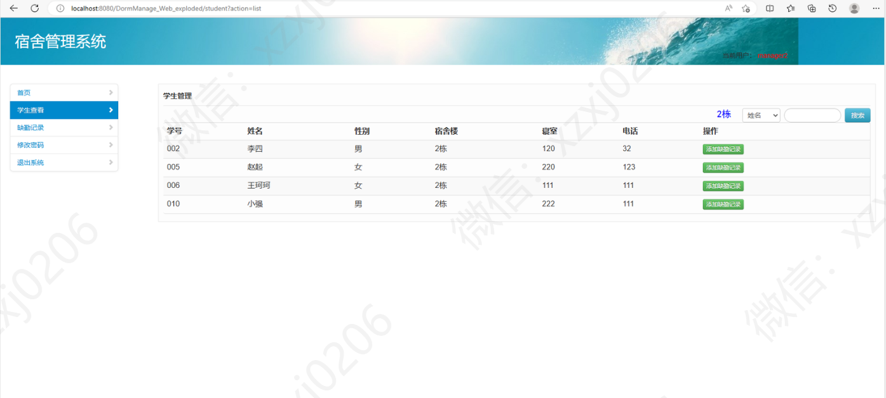

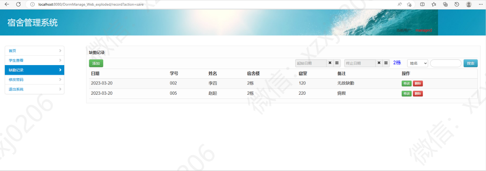

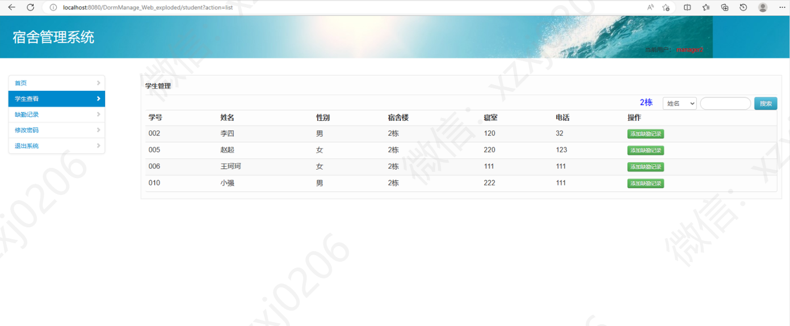

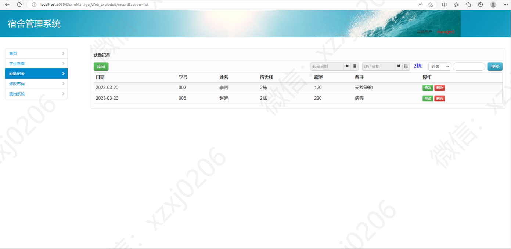
